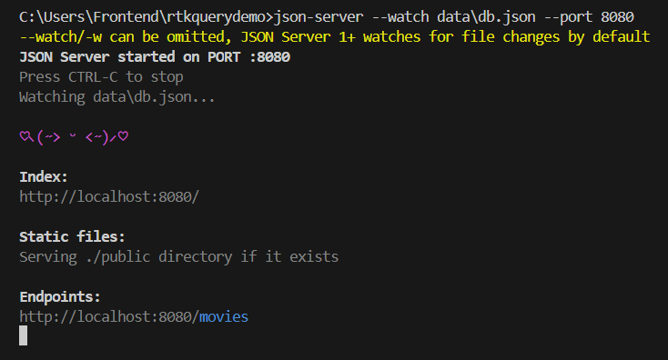
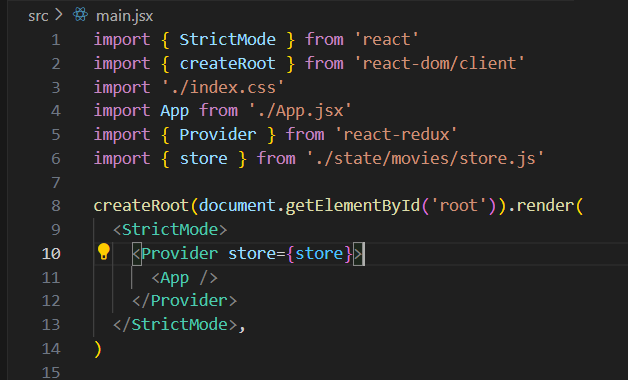

## Redux ToolKit ( RTK ) query
RTK Query is built on top of Redux Toolkit and is created to simplify data fetching and caching in web applications.

# json-server
A lightweight framework of Nodejs that helps to create mockup apis for frontend without writting any server side code
    npm i -g json-server

# Folder Structure

# 1
run this command : 
json-server --watch data\db.json --port 8080
This command will start up your JSON server and wrap the API endpoint running on port 8080. 

# 2
create an API slice

We now create moviesApiSlice using createApi function from RTK Query
- reducerPath specifies the path of API slice
- baseQuery uses the fetchBaseQuery function which takes in an object as a parameter which has a baseURL property(root URL)
-The endpoints property is what our API interacts with. 
- It’s a function that takes in a builder parameter and returns an object with methods (getMovies, addMovie, updateMovie, and deleteMovie) for interacting with our API.

- Lastly, We are exporting custom hooks generated automatically by RTK Query. 
The custom hook starts with "use" and ends with "query" and is named based on the methods defined in the endpoints property.

# 3
Setup Redux store
- We are setting up a Redux store using the configureStore function from Redux Toolkit. 
The reducer property specifies a reducer for updating the state in the Redux store. 
The moviesApiSlice.reducer is the reducer for updating the state of your API.

- For the middleware property, you are creating a middleware for handling asynchronous state updates. 
You don't have to worry too much about this part and what it does. 
This is required for all the caching functionality and all the other benefits that RTK Query provides.

# 4
Add redux store to main.jsx or index.jsx

# 5
Now we will create a Movies component and use RTK Query to handle CRUD operations.
1. We will import the useGetMoviesQuery, useAddMovieMutation, and useDeleteMovie functions from the moviesApiSlice which will be used for fetching, adding, and deleting movies, respectively.
2. We defined the state variables: title, year, thumbnail and desc
3. The useGetMoviesQuery hook fetches the movie data when the component mounts. The hook returns an object with several properties, but we're focusing on three properties: data aliased as movies, isLoading, and isError.
while,
The useAddMovieMutation and useDeleteMovieMutation hooks return two functions: addMovie and deleteMovie, respectively.
4. The handleSubmit function handles the submission of the form. When the form is submitted, the addMovie function is called with the new movie details.
5. If everything goes well, the main JSX structure of the component is returned, which includes:
    - a form for adding new movies.
    - a list of movies rendered using the MovieCard component. EachMovieCard is passed the individual movie data along with the deleteMovie function to handle deletions.